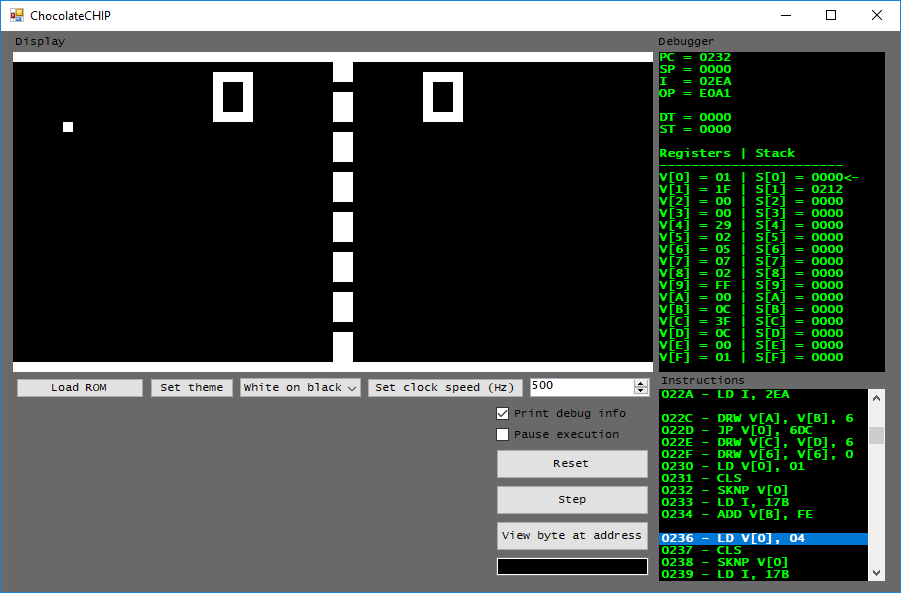

# ChocolateCHIP
This is a basic (i.e. vanilla instructions only) CHIP-8 interpreter. It is written in C# and uses Windows Forms as a frontend. 

# Features
- Variable clock speed 
- Color settings
- Debugger
  - Pause/step through execution 
  - View instructions 
  - View registers, stack, PC, opcode
  - View memory address

# Screenshots

# Issues
This was undertaken mainly as a learning exercise, so ROM compatibility may be spotty. In particular, some ROMs expect logic/shift operations to place the result in register VY (the original method) rather than VX (the most common method). Additionally, a few ROMs expect graphics to clip over the edge of the screen rather than wrapping across via modulo operations. One example of this is BLITZ, where sprite wrapping causes unintended game-overs. Sound is currently not supported, although the sound timer is present and functions (seemingly) properly. 

